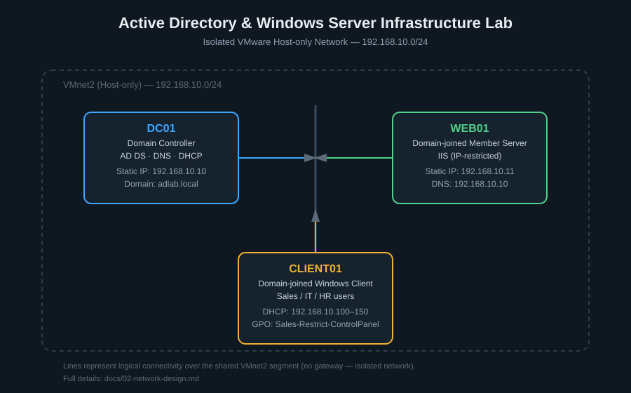

# 🖥️ Active Directory & Windows Server Infrastructure Lab

A hands-on lab simulating a small organization's core Windows Server infrastructure — built from scratch in VMware Workstation, focused on understanding how Active Directory, DNS, and DHCP actually depend on each other, not just configuring them in isolation.

## 📖 Overview

This project is part of my ongoing, practical exploration of infrastructure, networking, and system administration alongside my CS/AI studies. I'm learning by building: designing the network first, then implementing each service deliberately, validating every step, and documenting the reasoning — not just the commands.

The lab represents a small fictional company (**adlab**) with three departments (IT, HR, Sales), running on an isolated VMware Host-only network.

## 🚧 Current Status

**`v1.0.0` released.** The core infrastructure — network, AD DS, DNS, DHCP, OU/user/group structure, a domain-joined client, a tested Group Policy, a second member server running IIS, and a validated security baseline — is complete, tested, and documented. Additional troubleshooting scenarios and further hardening are planned for future releases.

See [`ROADMAP.md`](./ROADMAP.md) for the full phase breakdown and [`CHANGELOG.md`](./CHANGELOG.md) for release notes.

## ✅ What's Been Built So Far

- Isolated VMware Host-only network (`192.168.10.0/24`) designed before any service was installed
- A Domain Controller (`DC01`) with a static IP, running AD DS and DNS
- A domain (`adlab.local`) with a hybrid OU structure (per-department Users/Computers OUs, plus a company-wide Groups OU)
- 6 domain users across 3 departments, organized into 4 security groups
- DHCP with a scoped address pool, authorized in AD, tested against a real client
- A domain-joined Windows client (`CLIENT01`), confirmed with a successful domain user login
- A Group Policy restricting Control Panel access for one department, validated with both a positive test (restricted where expected) and a negative test (unaffected elsewhere)
- A second, dedicated Member Server (`WEB01`) running IIS, domain-joined and reachable from the client by DNS name — not just IP
- A domain-wide password and account lockout policy, validated by triggering an actual lockout and confirming it from both the client and admin side
- An IP-restricted IIS site, validated with an allowed request (success) and a disallowed request (403 Forbidden)

Full details, including design decisions and validation results, are in [`docs/`](./docs/).

## 🧰 Tech Stack

- VMware Workstation
- Windows Server (Active Directory Domain Services, DNS, DHCP, IIS)
- Windows 10/11 (domain client)
- Group Policy Management

## 📚 Documentation

| Doc | Covers |
|---|---|
| [`docs/01-architecture.md`](./docs/01-architecture.md) | Project overview and design principles |
| [`docs/02-network-design.md`](./docs/02-network-design.md) | VMware network, IP addressing plan |
| [`docs/03-active-directory.md`](./docs/03-active-directory.md) | Domain, OU structure, users, groups, validation |
| [`docs/04-dns.md`](./docs/04-dns.md) | DNS configuration and validation |
| [`docs/05-dhcp.md`](./docs/05-dhcp.md) | DHCP scope and validation |

More documents (Group Policy, IIS, Security, Testing, Troubleshooting) will be added as those phases are completed.

## 💡 Why This Project

I wanted to go beyond "install Active Directory" tutorials and actually understand *why* each piece is configured the way it is — why DNS has to come before AD can be trusted, why static addressing matters for a DC, why DHCP servers need authorization. This lab is my way of testing that understanding hands-on, one validated step at a time.

## 📄 License

This project is licensed under the [MIT License](./LICENSE).
