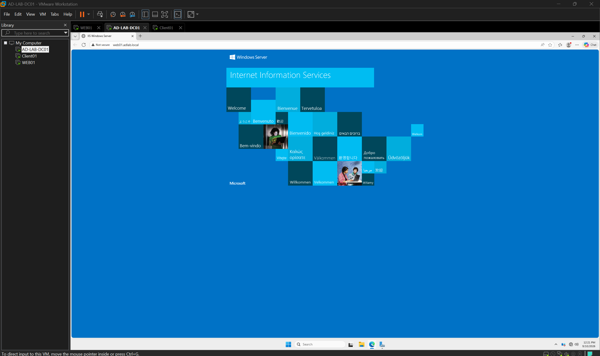

# IIS (Internet Information Services)

## 1. Overview

Rather than installing IIS directly on the Domain Controller, a separate, dedicated Member Server (`WEB01`) was built for this role. This mirrors real-world practice: Domain Controllers are kept as clean and minimal as possible, and services like a web server are placed on a dedicated machine instead.

## 2. Server Details

| Item | Value |
|---|---|
| Hostname | WEB01 |
| Role | Domain-joined Member Server (not a Domain Controller) |
| Static IP | 192.168.10.11 |
| Subnet mask | 255.255.255.0 |
| Preferred DNS | 192.168.10.10 (DC01) |
| Domain | adlab.local |
| Installed role | Web Server (IIS), default role services |

## 3. Updated IP Addressing Plan

| Device | IP Address | Role |
|---|---|---|
| DC01 | 192.168.10.10 | Domain Controller / DNS / DHCP |
| WEB01 | 192.168.10.11 | Member Server / IIS |
| CLIENT01 | 192.168.10.100–150 (DHCP) | Domain-joined client |

## 4. Domain Join Sequence (Important Order)

A common mistake when joining a member server to a domain is attempting the join before DNS is correctly pointed at the Domain Controller. The correct order followed here:

1. Set static IP (192.168.10.11) and subnet mask
2. Set **Preferred DNS server to 192.168.10.10** (the Domain Controller) — done *before* attempting the join
3. Only then: System Properties → Computer Name → Change → Domain → `adlab.local`

Attempting the domain join before step 2 typically fails with an error indicating the domain controller cannot be contacted, since the server cannot resolve `adlab.local`'s SRV records without the correct DNS server configured.

## 5. Validation

| Test | Run From | Target | Result |
|---|---|---|---|
| Local IIS default page | WEB01 (localhost) | `http://localhost` | IIS default welcome page loaded |
| Remote access by IP | CLIENT01 | `http://192.168.10.11` | IIS default page loaded successfully |
| Remote access by domain name | CLIENT01 | `http://web01.adlab.local` | IIS default page loaded successfully — confirms DNS automatically registered WEB01's record upon domain join |

**Conclusion:** the full chain was validated end-to-end — a separately built, domain-joined member server, automatically registered in DNS, serving a web page reachable by name (not just IP) from another domain-joined machine. This confirms DNS, AD DS, and IIS are functioning together correctly across multiple servers, not just in isolation on a single box.

## 6. Next Steps

IP/domain-based access restrictions on the IIS site, and any relevant security hardening, will be covered under Phase 9 (Security Baseline).
