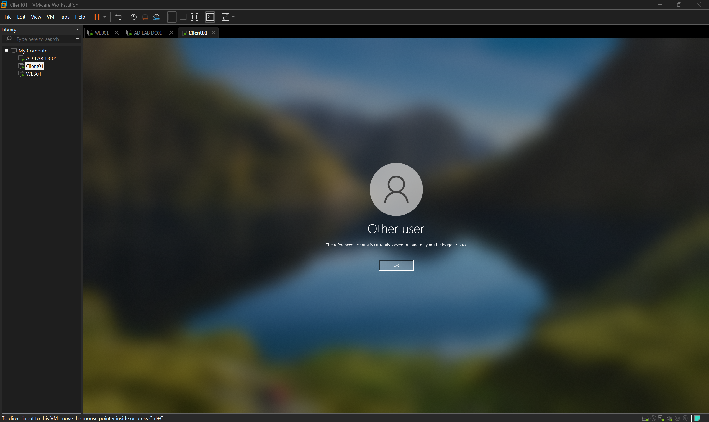
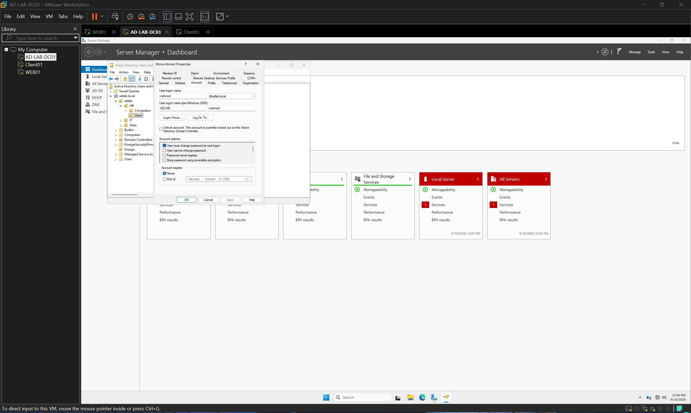
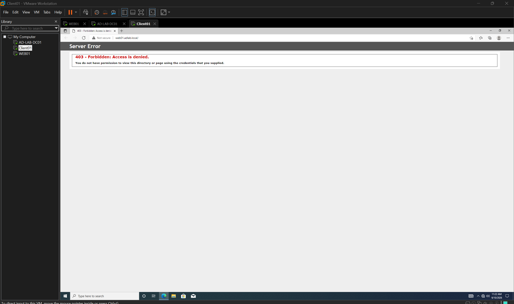

# Security Baseline

## 1. Overview

This document covers the security controls applied across the lab: a domain-wide password and account lockout policy, and an IP-based access restriction on the IIS site. Each control was validated with both a positive test (behavior occurs where expected) and a negative test (behavior does not leak elsewhere), following the same validation discipline used throughout this project.

## 2. Password Policy

Applied at the **Default Domain Policy** level (Computer Configuration → Security Settings → Account Policies → Password Policy). Domain-wide password settings in Active Directory can only be enforced from this domain-level GPO — linking a password policy to a sub-OU has no effect on domain user accounts, so it was deliberately configured here rather than on a department-level GPO.

| Setting | Value |
|---|---|
| Enforce password history | 5 passwords remembered |
| Maximum password age | 90 days |
| Minimum password age | 1 day |
| Minimum password length | 8 characters |
| Password must meet complexity requirements | Enabled |

## 3. Account Lockout Policy

Applied at the same domain level, alongside the password policy.

| Setting | Value |
|---|---|
| Account lockout threshold | 5 invalid attempts |
| Account lockout duration | 15 minutes |
| Reset account lockout counter after | 15 minutes |

### Validation

| Step | Result |
|---|---|
| Entered an incorrect password 5 times for a domain user (`mahmed`) on CLIENT01 | Account locked; login screen showed: *"The referenced account is currently locked out and may not be logged on to."* |
| Checked the account in ADUC (Account tab) | Confirmed: *"This account is currently locked out on this Active Directory Domain Controller"*, with an Unlock option available |
| Unlocked the account via ADUC and re-attempted login with the correct password | Successful login, confirming the unlock took effect |

**Conclusion:** the policy was validated from both the client side (the user-facing lockout message) and the administrative side (ADUC reflecting the locked state and offering the unlock control), confirming end-to-end enforcement.

## 4. IIS Access Restriction (IP-Based)

Applied on `WEB01`, IIS Manager → Default Web Site → IP Address and Domain Restrictions.

| Setting | Value |
|---|---|
| Access for unspecified clients | Deny |
| Allow rule | 192.168.10.10 (DC01) only |

### Design Rationale

This mirrors a common real-world scenario: an internal administrative site that should only be reachable from specific trusted machines, not from every device on the network — even devices, like `CLIENT01`, that are legitimately domain-joined.

### Validation

| Test | Source | Result |
|---|---|---|
| Request from an allowed IP | DC01 (192.168.10.10) | IIS default page loaded normally |
| Request from a non-allowed IP | CLIENT01 (DHCP-assigned, outside the allow list) | **403 - Forbidden: Access is denied** |

**Conclusion:** the restriction was proven in both directions — allowed traffic passes, and non-allowed traffic (even from a legitimate domain member) is blocked. This confirms the rule is enforced by IP, not by domain membership or authentication.

## 5. Summary

| Control | Scope | Status |
|---|---|---|
| Password Policy | Domain-wide (Default Domain Policy) | Applied & validated |
| Account Lockout Policy | Domain-wide (Default Domain Policy) | Applied & validated |
| IIS IP Restriction | WEB01 / Default Web Site | Applied & validated |

## 6. Next Steps

Basic auditing (logging failed/successful logon attempts) and administrative account separation were considered as additional security baseline items but are deferred; if added later, they will be documented here as an extension of this section.
